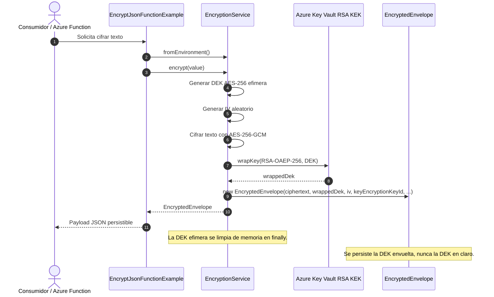
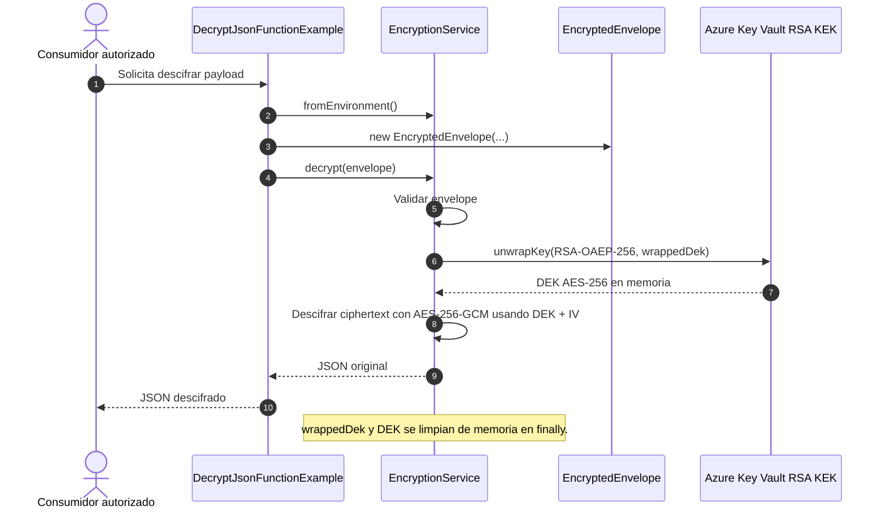

# Diagrama de secuencia - PoC simplificada

## Clases necesarias

Para la PoC se mantiene un diseno puntual con pocas clases:

| Clase | Responsabilidad |
| --- | --- |
| `EncryptJsonFunctionExample` | Simula el punto de entrada que solicita cifrar un JSON. |
| `DecryptJsonFunctionExample` | Simula el punto de entrada que solicita descifrar un envelope. |
| `EncryptionService` | Genera la AES efimera, cifra/descifra texto con AES-GCM y hace wrap/unwrap en Key Vault RSA. |
| `EncryptedEnvelope` | Payload persistible con `ciphertext`, `iv`, `wrappedDek` y `keyEncryptionKeyId`. |
| `SqlServerEnvelopeRepository` | Guarda y lee el envelope cifrado como JSON en la columna `datamap`. |
| `CryptoPocException` | Excepcion personalizada unica con codigo de error. |

## Secuencia de cifrado



## Secuencia de cifrado y persistencia en SQL Server

```mermaid
sequenceDiagram
    autonumber
    actor Caller as Consumidor / Azure Function
    participant Entry as EncryptAndSaveSqlServerExample
    participant Service as EncryptionService
    participant KV as Azure Key Vault RSA KEK
    participant Repo as SqlServerEnvelopeRepository
    database SQL as SQL Server

    Caller->>Entry: Solicita cifrar y guardar texto
    Entry->>Service: encrypt(value)
    Service->>Service: Generar DEK AES-256 efimera + IV
    Service->>Service: Cifrar texto con AES-256-GCM
    Service->>KV: wrapKey(RSA-OAEP-256, DEK)
    KV-->>Service: wrappedDek
    Service-->>Entry: EncryptedEnvelope

    Entry->>Repo: save(businessId, envelope)
    Repo->>SQL: INSERT dbo.EncryptedEnvelopeStore
    SQL-->>Repo: OK
    Repo-->>Entry: Id
    Entry-->>Caller: Id + BusinessId

    Note over SQL: SQL almacena el EncryptedEnvelope completo como JSON en datamap. No almacena DEK en claro.
```

## Secuencia de descifrado



## Secuencia de lectura SQL Server y descifrado

```mermaid
sequenceDiagram
    autonumber
    actor Caller as Consumidor autorizado
    participant Entry as ReadAndDecryptSqlServerExample
    participant Repo as SqlServerEnvelopeRepository
    database SQL as SQL Server
    participant Service as EncryptionService
    participant KV as Azure Key Vault RSA KEK

    Caller->>Entry: Solicita leer y descifrar por BusinessId
    Entry->>Repo: findLatestByBusinessId(businessId)
    Repo->>SQL: SELECT TOP (1) datamap
    SQL-->>Repo: JSON del EncryptedEnvelope
    Repo->>Repo: EncryptedEnvelope.fromJson(datamap)
    Repo-->>Entry: EncryptedEnvelope

    Entry->>Service: decrypt(envelope)
    Service->>KV: unwrapKey(RSA-OAEP-256, wrappedDek) usando keyEncryptionKeyId del envelope
    KV-->>Service: DEK AES-256 en memoria
    Service->>Service: Descifrar ciphertext con AES-256-GCM usando DEK + IV
    Service-->>Entry: Texto original
    Entry-->>Caller: Texto descifrado

    Note over Service: La DEK recuperada se limpia de memoria en finally.
```

## Principios y patrones aplicados sin sobreingenieria

- **Single Responsibility:** `EncryptionService` concentra el caso de uso criptografico completo; `EncryptedEnvelope` solo transporta datos.
- **Encapsulation:** los detalles de AES-GCM y Key Vault quedan ocultos dentro del servicio.
- **Facade:** el consumidor solo llama `encrypt` y `decrypt`.
- **DTO:** `EncryptedEnvelope` representa el payload que puede guardarse en SQL.
- **Custom Exception:** `CryptoPocException` entrega errores controlados sin exponer detalles innecesarios del SDK.

Esta version sacrifica extensibilidad fina a cambio de claridad, que es razonable para una PoC.
